<div align="center">
  
# 🏛️ CivicMind
### AI-Powered Smart Civic Issue Reporting & Resolution Platform


Built for the Vibe2Ship Hackathon 2026 under the theme **AI for Smart Cities**, majorly utilizing Google AI Studio.

[Live Demo](https://civicmind-understanding-agent-229084139257.asia-southeast1.run.app) • [Documentation](https://docs.google.com/document/d/1ngnR-ALoRkE8lDMmZpl-nvosxxZiaHVWd97iNzGl6xY/edit?usp=sharing)

</div>

---

## 📖 Table of Contents
- [Project Overview](#-project-overview)
- [Google AI Studio Integration](#-google-ai-studio-integration)
- [Hackathon Requirements (Judges' Guide)](#-hackathon-requirements-judges-guide)
- [Key Features](#-key-features)
- [Google Technologies Utilized](#-google-technologies-utilized)
- [Tech Stack](#-tech-stack)
- [System Architecture](#-system-architecture)
- [Application Flow](#-application-flow)
- [Screenshots](#-screenshots)
- [Project Structure](#-project-structure)
- [Installation & Setup](#-installation--setup)
- [Environment Variables](#-environment-variables)
- [Future Improvements](#-future-improvements)
- [Deployment](#-deployment)
- [Made By](#-made-by)
- [License](#-license)
- [Contact](#-contact)

---

## 🌍 Project Overview

### The Problem
Traditional civic reporting systems are fundamentally broken. They are plagued by manual routing, subjective prioritization, endless bureaucratic bottlenecks, and "black-hole" feedback loops where citizens never hear back about their reports. This leads to frustrated citizens, inefficient resource allocation, and deteriorating city infrastructure.

### The CivicMind Solution
CivicMind is a hyperlocal problem solver that transforms how communities report, process, and resolve infrastructure issues. By leveraging state-of-the-art Artificial Intelligence (Google Gemini), CivicMind automatically analyzes submitted reports (text, voice, or image), categorizes them, assigns a severity score, and routes them to the correct municipal department—all in real-time.

We bring transparency, speed, and intelligence to smart city management.

### 🛠️ Google AI Studio Integration
This project was prototyped, built, and optimized primarily using Google AI Studio. System instructions, multimodal image analysis logic, and structured JSON output schemas for the Gemini API were thoroughly developed and tested within Google AI Studio. This enabled rapid iteration and validation of model prompts before integrating them into the backend server.

---

## 🏆 Hackathon Requirements (Judges' Guide)
<details open>
<summary><b>Click to expand Hackathon Details</b></summary>

| Criteria | Implementation in CivicMind |
| :--- | :--- |
| **Problem Statement** | Statement 2 – Community Hero: Hyperlocal Problem Solver. We empower citizens to instantly report and track local issues while equipping city officials with an AI-triaged dashboard. |
| **Theme Alignment** | AI for Smart Cities. Integrates AI directly into the municipal lifecycle to create autonomous, self-organizing urban maintenance workflows. |
| **Solution Overview** | An end-to-end platform bridging the gap between citizens and city officials via AI-automated triaging, mapping, and priority detection. |
| **Impact & Community Benefits** | Reduces issue triage time from days to seconds. Promotes civic engagement through transparent timelines and community verification. Saves municipal resources. |
| **Innovation & AI Capabilities** | Replaces human dispatchers with multimodal AI. Features AI Confidence Scoring, automatic severity detection, and smart deduplication of nearby issues. |

</details>

---

## ✨ Key Features
CivicMind is packed with intelligent features designed for both citizens and city officials:

### 🤖 AI & Automation
- **AI-Powered Issue Detection:** Analyzes uploaded images to identify potholes, broken lights, leaks, etc.
- **Smart Categorization & Priority:** Automatically determines issue severity (Low, Medium, Critical).
- **AI Confidence Score:** Displays the AI's certainty percentage for data transparency.
- **Voice & Text Reporting:** NLP-driven processing of natural language complaints.
- **Nearby Issue Deduplication:** AI detects and merges duplicate reports in the same geofence.
- **AI Insights:** Provides city officials with predictive maintenance recommendations.

### 🏙️ Civic & Officer Tools
- **Interactive Google Maps:** Visual spatial plotting of all active and resolved issues.
- **Officer Dashboard:** A high-performance, Kanban-style triage center for municipal workers.
- **Citizen Dashboard:** A personalized hub to track the live status and timeline of submitted issues.
- **Community Verification:** Citizens can "upvote" or verify existing issues to boost priority.
- **Smart Notifications:** Real-time alerts when issue statuses change.

### 🎨 UI / UX
- **Responsive Design:** Flawless experience across mobile, tablet, and desktop.
- **Dark & Light Theme:** Accessible, premium visual aesthetics.
- **Role-Based Authentication:** Secure, separate experiences for Citizens and Officers.

---

## ⚡ Google Technologies Utilized
CivicMind is proudly built on the Google ecosystem to ensure scale, speed, and intelligence.

| Technology | Purpose in CivicMind |
| :--- | :--- |
| **Gemini API** | The core brain. Used for multimodal image analysis, NLP text parsing, sentiment analysis, and priority scoring. |
| **Google Maps API** | Provides interactive, hyperlocal mapping, geocoding, and spatial data visualization for issue tracking. |
| **Google Cloud Run** | Serverless deployment of our backend container, ensuring scale-to-zero capabilities and high availability. |
| **Vertex AI** | (If applicable) Advanced model tuning and predictive analytics for city infrastructure degradation. |
| **Material Design 3** | UI principles utilized to ensure accessible, intuitive, and modern user interfaces. |

---

## 🛠️ Tech Stack

### Frontend
-  **React.js** - UI Library
-  **Tailwind CSS** - Utility-first styling
-  **Material UI** - Component library
-  **Framer Motion & GSAP** - Fluid animations
-  **React Router** - Navigation
-  **Axios** - HTTP client

### Backend & Database
-  **Node.js & Express.js** - Server environment & framework
-  **MongoDB** - NoSQL Database
-  **JWT & bcrypt** - Secure Authentication

### Infrastructure
-  **Google Cloud Platform**
-  **GitHub** - Version Control & Actions

---

## 🏗️ System Architecture

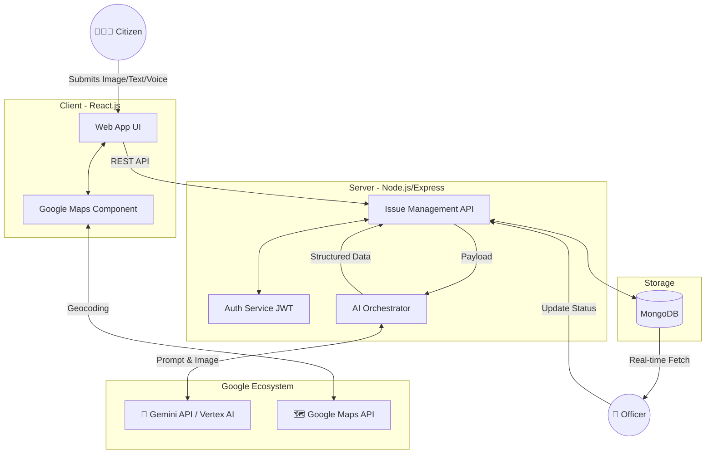

---

## 🔄 Application Flow

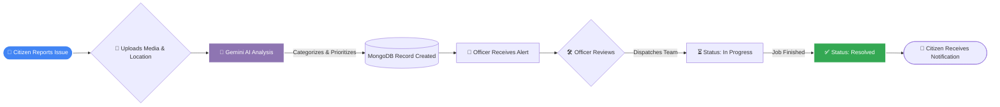

---

## 📂 Project Structure

```text
CivicMind/
├── client/                     # React Frontend
│   ├── public/                 # Static assets
│   ├── src/
│   │   ├── assets/             # Images, icons, global styles
│   │   ├── components/         # Reusable UI components
│   │   ├── context/            # React Context (Auth, Theme)
│   │   ├── hooks/              # Custom React Hooks
│   │   ├── pages/              # Route pages (Dashboard, Login, etc.)
│   │   ├── services/           # API integration logic
│   │   └── utils/              # Helper functions
│   └── package.json
│
├── server/                     # Node.js Backend
│   ├── controllers/            # Business logic (Issue, Auth, AI)
│   ├── middleware/             # JWT Verification, Error handling
│   ├── models/                 # Mongoose Schemas
│   ├── routes/                 # Express API Routes
│   ├── utils/                  # Gemini Prompt Configs, helpers
│   ├── .env.example            # Environment config template
│   └── server.js               # Entry point
│
└── README.md                   # Project documentation
```

---

## 📸 Screenshots

| Landing Page | Authentication |
| :---: | :---: |
| 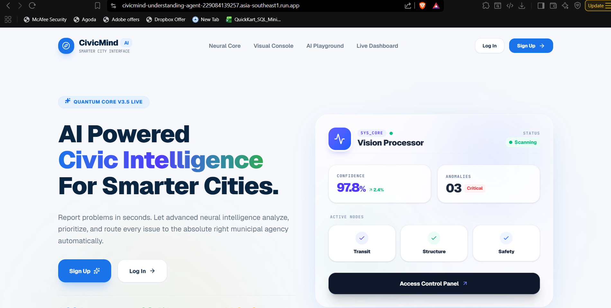 | 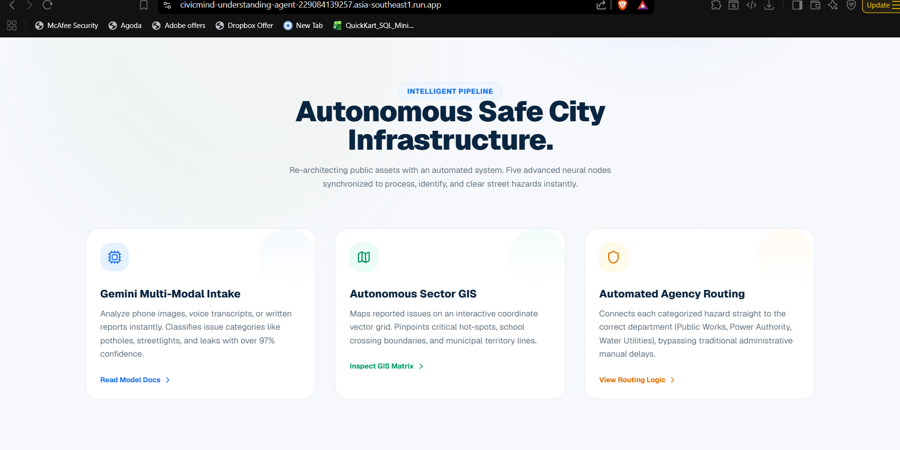 |
| **Citizen Dashboard** | **Report Issue Form** |
| 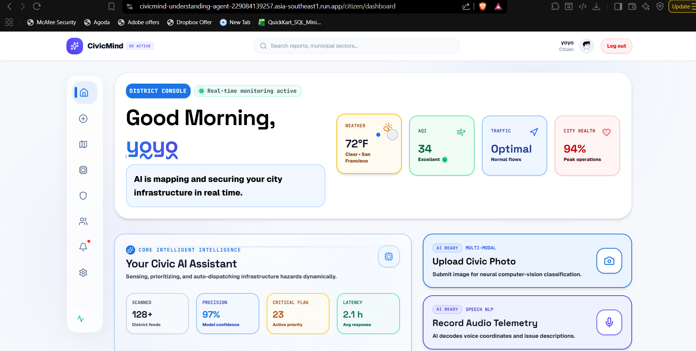 | 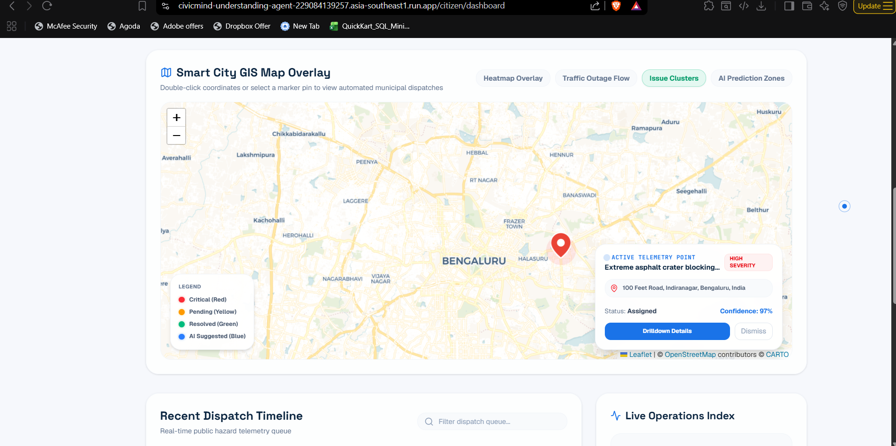 |
| **Interactive Map View** | **Issue Details (AI Analysis)** |
| 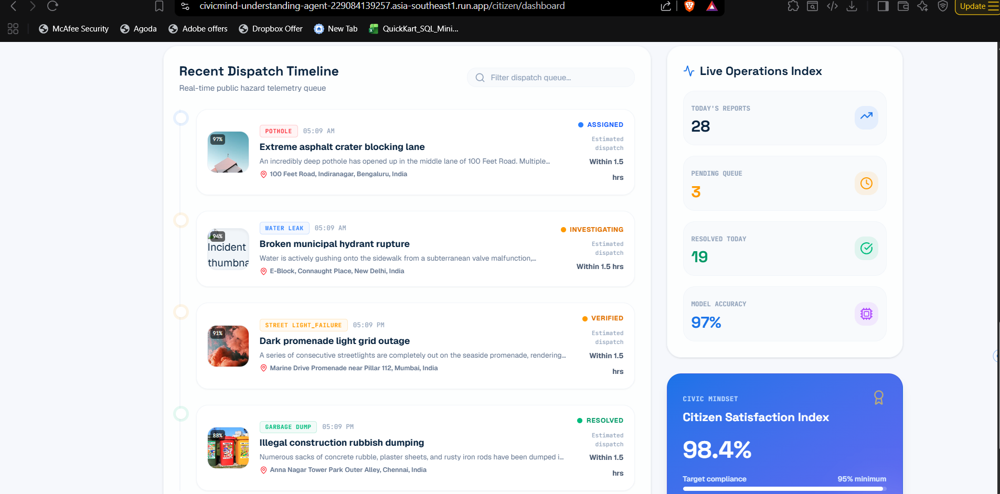 | 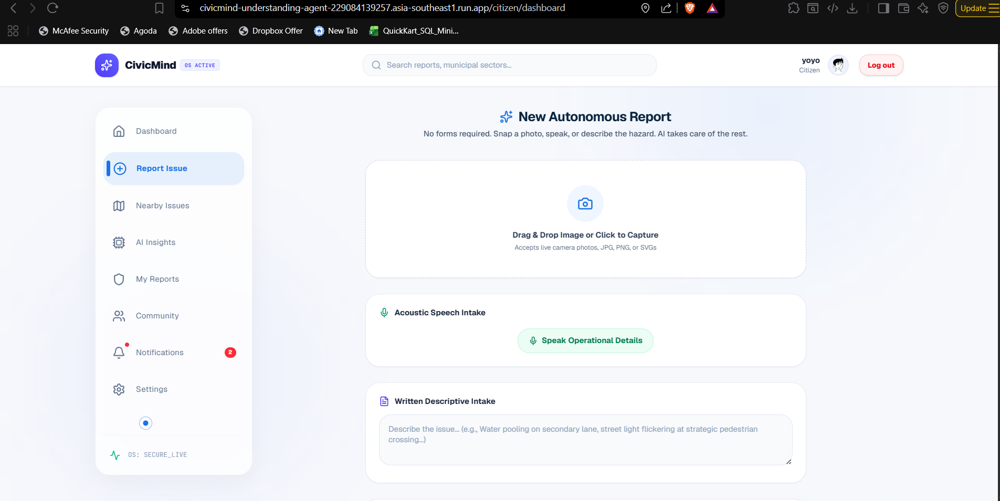 |
| **Officer Dashboard** | **Notifications Hub** |
| 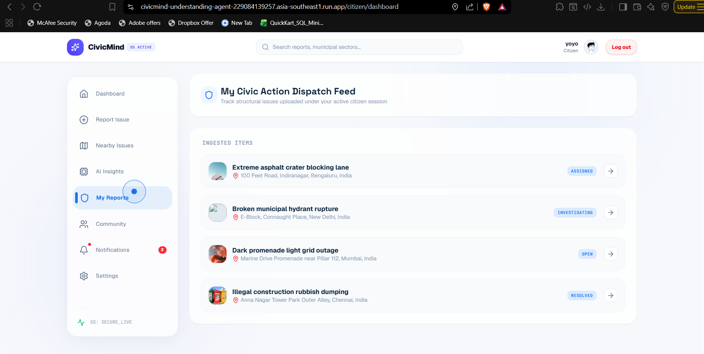 | 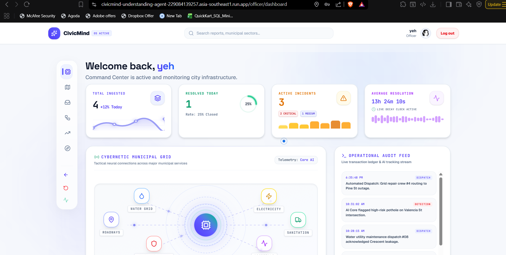 |
| **AI Triaging Details** | **Platform Settings & Theme** |
| 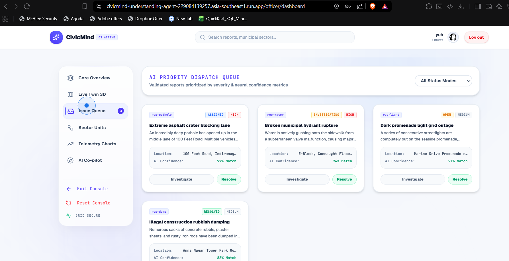 | 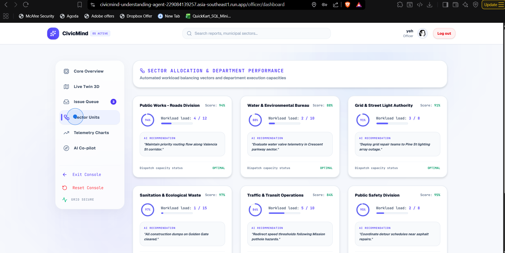 |

---

## 🚀 Installation & Setup
Follow these instructions to run CivicMind locally.

### Prerequisites
- Node.js (v18 or higher)
- MongoDB (Local instance or MongoDB Atlas)
- Google Cloud Console Account (For Maps & Gemini API Keys)

### 1. Clone the Repository
```bash
git clone https://github.com/yourusername/CivicMind.git
cd CivicMind
```

### 2. Install Dependencies
Install the required Node.js packages in the project root:
```bash
npm install
```

### 3. Setup Environment Variables
Create a `.env` file in the root directory by copying `.env.example` and filling in your credentials.

> [!IMPORTANT]
> You must add your own `GEMINI_API_KEY` in the `.env` file to use the AI capabilities of this project.

### 4. Run the Application
Start the development server (runs both backend API and frontend Vite middleware on port 3000):
```bash
npm run dev
```
The application will be running at `http://localhost:3000`.

---

## 🔐 Environment Variables
Create a `.env` file in the project root directory with the following structure:
```env
# Server Configuration
PORT=3000
NODE_ENV=development

# Database
MONGODB_URI=mongodb+srv://<username>:<password>@cluster.mongodb.net/civicmind?retryWrites=true&w=majority

# Authentication
JWT_SECRET=your_super_secret_jwt_key_here
JWT_EXPIRES_IN=7d

# Google APIs
GEMINI_API_KEY=your_gemini_api_key_here
GOOGLE_MAPS_API_KEY=your_google_maps_api_key_here
```

---

## 🔮 Future Improvements
We have a massive vision for CivicMind. Post-hackathon, we plan to implement:
- **Drone Inspection Integration:** Autonomous drones investigating critical AI-flagged zones.
- **IoT Sensor Sync:** Connecting smart city sensors (water pressure, traffic) to automatically open tickets.
- **Satellite Monitoring:** Using Google Earth Engine to detect macro infrastructure shifts.
- **Blockchain Verification:** Immutable ledgers for municipal budgets and repair completion verification.
- **Emergency Alert Broadcasts:** Push notifications to citizens based on hyperlocal critical hazards.

---

## 🌐 Deployment
- **Live Demo (Google Cloud Run):** [https://civicmind-understanding-agent-229084139257.asia-southeast1.run.app](https://civicmind-understanding-agent-229084139257.asia-southeast1.run.app)

---

## 🧑‍💻 Made By
Built with ❤️ by **Shivam Maurya** ([@scriptedbyshivam](https://github.com/scriptedbyshivam)).

---

## 📄 License
This project is licensed under the MIT License. See the [LICENSE](LICENSE) file for the full license text.

---

## 📫 Contact
For any inquiries, feedback, or collaboration opportunities:
- **Email:** shivam2024maurya@gmail.com
- **Website:** [https://civicmind-understanding-agent-229084139257.asia-southeast1.run.app](https://civicmind-understanding-agent-229084139257.asia-southeast1.run.app)

<div align="center">
<br>
<i>Crafted with ❤️ for the Vibe2Ship Hackathon 2026</i>
</div>
